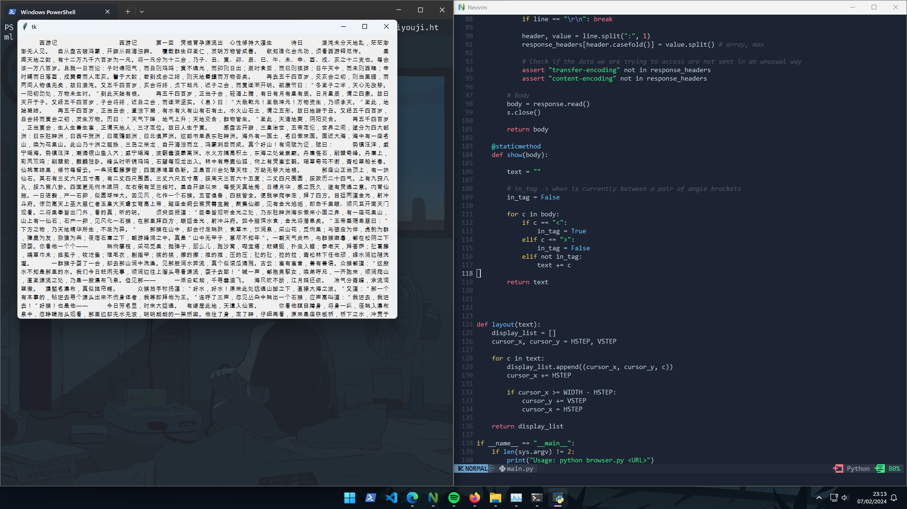

# FireBox

**NOTE: I'm still working on the project; so far, it's just a prototype, and I'm still learning. Although it could be easily mistaken for a real browser xD I welcome any kind of tips :)**

Why?
> First, I was very bored and wanted to undertake a challenging project, so I created this project to learn more about how browsers work and the internet in general.


Origin of the name:
> The name FireBox is a joke since instead of writing firefox, I usually write firebox. Why? Good question, I don't know either


## Code operation

### Request
```
class URL:
    def __init__(self, url):
        # Check if the URL contains a scheme, otherwise add "http://"
        if "://" not in url:
            url = "http://" + url  # Default to "http://" if no scheme provided

        # Split the URL by "://" and assign the appropriate scheme and the rest of the URL
        self.scheme, url = url.split("://", 1)
        assert self.scheme in ["http", "https"]  # Verify if the scheme is valid

        # Add a slash (/) at the end of the URL if it doesn't exist
        if "/" not in url:
            url = url + "/"

        # Split the URL by the first slash (/) to separate the host and the path
        self.host, url = url.split("/", 1)
        self.path = "/" + url

    def request(self):

        # Create a socket
        s = socket.socket(
            family = socket.AF_INET,
            type= socket.SOCK_STREAM,
            proto=socket.IPPROTO_TCP,
        )

        # Host and Port
        s.connect((self.host, 80))

        # Make a request
        s.send(("GET {} HTTP/1.0\r\n".format(self.path) +
                "Host: {}\r\n\r\n".format(self.host)) \
                    .encode("utf8")) # \r\n instead of \n for newlines

        # Receive the response
        response = s.makefile("r", encoding="utf8", newline="\r\n")

        # Status
        statusline = response.readline()
        version, status, explanation = statusline.split(" ", 2)

        # Headers
        response_headers = {}
        # Note: Headers are case-insensitive and white-spaces are insignificant in HTTP header
        while True:
            line = response.readline()
            if line == "\r\n": break

            header, value = line.split(":", 1)
            response_headers[header.casefold()] = value.split() # array, max

            # Check if the data we are trying to access are not sent in an unusual way
            assert "transfer-encoding" not in response_headers
            assert "content-encoding" not in response_headers

        # Body
        body = response.read()
        s.close()

        return body

```
<!---->

### Version 1.0

